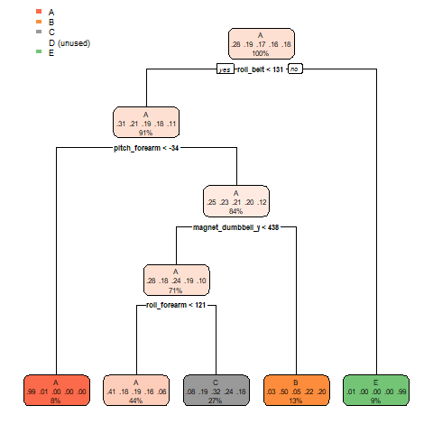
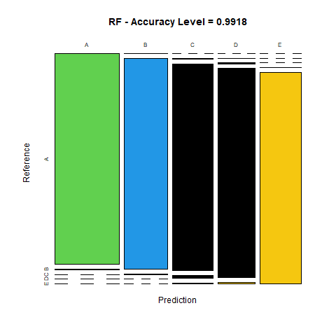

# Course project

## Background
Using devices such as Jawbone Up, Nike FuelBand, and Fitbit it is now possible to collect a large amount of data about personal activity relatively inexpensively. 
These type of devices are part of the quantified self movement – a group of enthusiasts who take measurements about themselves regularly to improve their health, 
to find patterns in their behavior, or because they are tech geeks. One thing that people regularly do is quantify how much of a particular activity they do, 
but they rarely quantify how well they do it. In this project, we will use data from accelerometers on the belt, forearm, arm, and dumbell of 6 participants.

## Data source

The training data for this project are available here:

https://d396qusza40orc.cloudfront.net/predmachlearn/pml-training.csv

The test data are available here:

https://d396qusza40orc.cloudfront.net/predmachlearn/pml-testing.csv

## Libraries

library(caret)

library(rpart)

library(rpart.plot)

library(rattle)

library(randomForest)

library(RColorBrewer)

## Data processing

Load the datasets

base.training <- read.csv("pml-training.csv", na.strings=c("NA","#DIV/0!", ""))
base.testing <- read.csv("pml-testing.csv", na.strings=c("NA","#DIV/0!", ""))

----- Clean and subset the datasets

base.training<-base.training[,colSums(is.na(base.training)) == 0]

base.testing <-base.testing[,colSums(is.na(base.testing)) == 0]

----- Remove the columns are not important to the project

base.training   <- base.training[,-c(1:7)]

base.testing <- base.testing[,-c(1:7)]

allNames <- names(base.training)
base.testing <- base.testing[,allNames[1:52]]

## Data partitioning

Divide the training data in training set and testing or cross validation set for prediction models.

inTrain <- createDataPartition(base.training$classe, p=0.75, list = FALSE)

training.2 <- base.training[inTrain,]

cross.val <- base.training[-inTrain,]

### Decision Tree Model

----- Fit model

dt.modifit <- train(classe ~ ., data = training.2, method="rpart")

----- Prediction

dt.prediction <- predict(dt.modifit, cross.val)

---- Change the type of the column as factor

confusionMatrix(as.factor(cross.val$classe), dt.prediction)

---- Plot the decision tree

rpart.plot(dt.modifit$finalModel, )

 

### Random forest model

---- Fit model

RF.modfit <- train(classe ~ ., data =training.2, method = "rf", ntree = 128)

---- Prediction

RF.prediction <- predict(RF.modfit, cross.val)

RF.conf <- confusionMatrix(RF.prediction, as.factor(cross.val$classe))

---- Plot the accuracy level

plot(RF.conf$table, col = as.factor(RF.conf$byClass), 
     main = paste("RF - Accuracy Level =",
                  round(RF.conf$overall['Accuracy'], 4)))
                  
 

### Test set
predict(RF.modfit, base.testing)

## Conclusion
Base on the confusion matrices,the Random forest algorithm has the best performance and accuracy compared to the Decision Trees, that is why this algorithm is selected.
